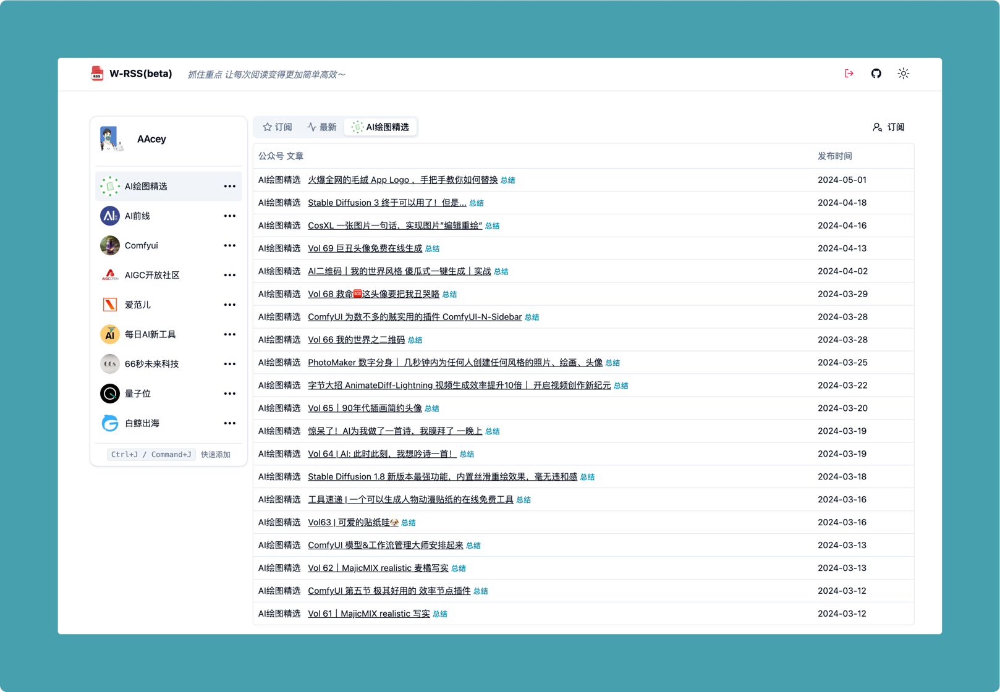

<h1 align="center"><a href="https://github.com/Aceysx/mp_rss">W-RSS</a></h1>

微信公众号&文章RSS聚合

公众号RSS源聚合。你可以在 [WRSS](https://firstool.online) 中免费订阅公众号，每天会定时将最新的所有公众号RSS源同步到该仓库

## [WRSS](https://firstool.online) 功能
- [x] 通过微信读书订阅
- [x] 搜索/取消公众号订阅
- [x] 刷新公众号文章
- [x] 定时同步 RSS
- [x] 通过 kimi AI 总结文章
- [x] 一键刷新全部订阅的公众号文章
- [ ] 下载公众号文章(RSS/PDF/HTML)
- [ ] 订阅日报/周报
- [ ] 公众号分析

### 公众号订阅
登录成功后，点击右上角订阅

### Kimi AI 总结文章
1. 参考[kimi-free-api](https://github.com/LLM-Red-Team/kimi-free-api?tab=readme-ov-file#%E6%8E%A5%E5%85%A5%E5%87%86%E5%A4%87)获取到 token
2. 将获取到的 token 放入到浏览器的 LocalStorage 中

3. 点击文章的`总结`

### Q&A
#### 为什么刷新不到最新的文章
该订阅方式是通过微信读书订阅，公众号->微信读书存在延时，请确保微信读书中已存在该公众号最新的文章

#### 提示 “请手动在微信读书 APP 上搜索某个公众号，处理验证码后再继续”
这是因为刷新的频率过高。需要在手机微信读书APP中搜索某个公众号进入详情处理验证码后重新刷新文章。（建议每天不要刷新超过20次）
